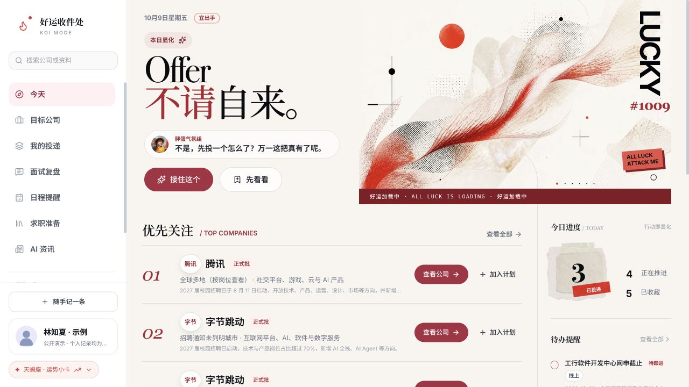
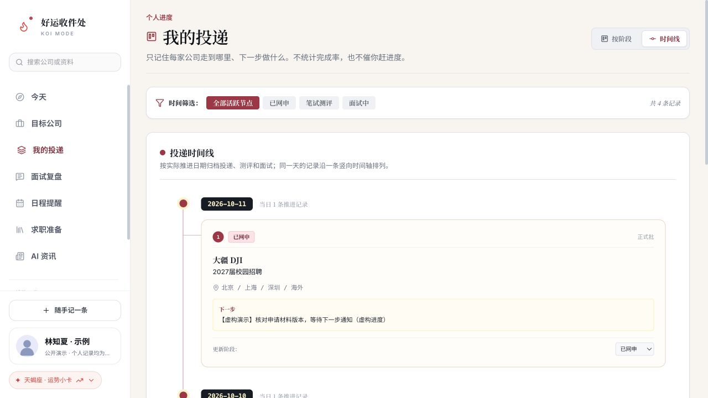
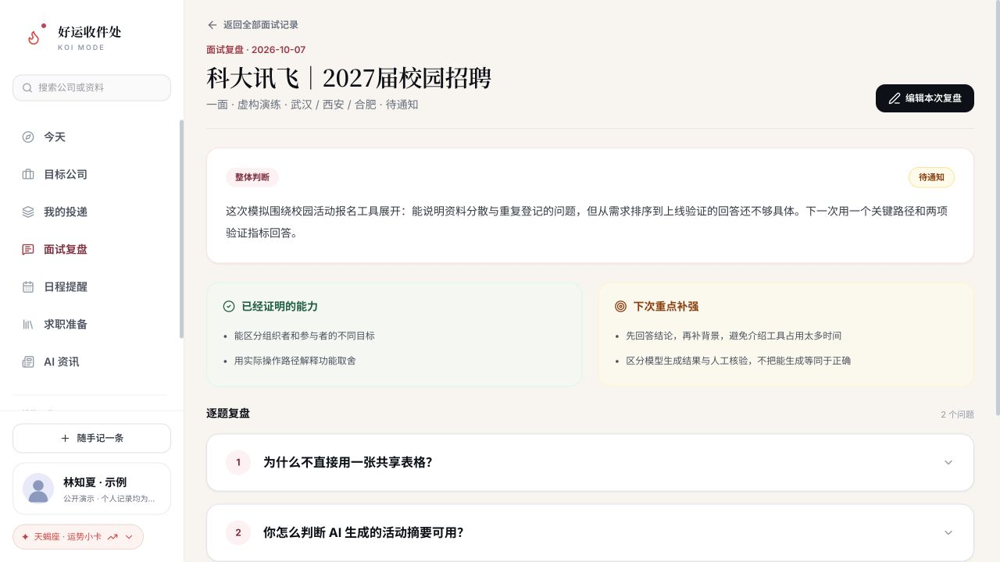
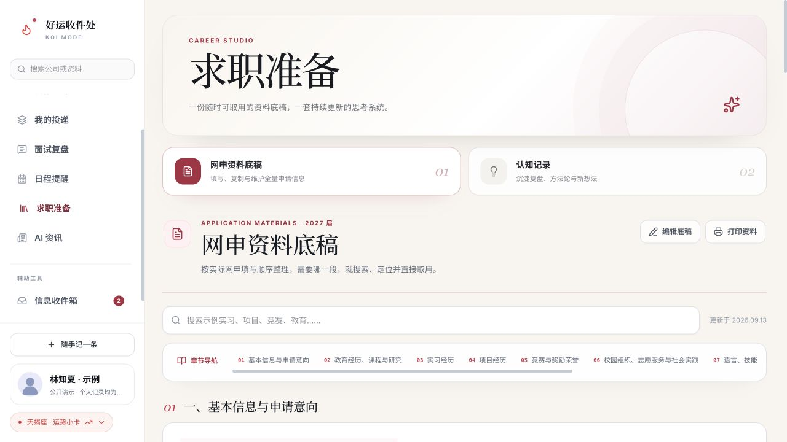

# 好运收件处 · 求职工作台

**把散落的信息、材料和重要节点，变成每天接得上的下一步。**

一个从个人秋招需求出发、在日常使用中持续迭代的 Web 工作台。把岗位发现、公司研究、投递进度、日程、网申资料和面试复盘放进同一个工作空间。

[在线体验](https://yusi21-bot.github.io/career-workbench/) · [产品设计与取舍](docs/product.md) · [实现与数据说明](docs/implementation.md) · [体验路线](docs/walkthrough.md)



## 为什么做这个

秋招是一个持续数月的任务。招聘信息来自官网、学校就业渠道、社群消息和个人收藏；同一家公司的不同批次可能重复出现，截止时间也未必明确。收藏了链接，并不代表知道是否适合自己，更不代表已经准备好材料。

真正开始申请以后，又会遇到另一组问题：不同网申系统的字段和字数不同，同一段经历要反复整理；投递、测评、面试分散在不同页面；某次面试暴露的问题，容易留在聊天记录里，没能转化成下一次准备。

我最初希望解决的是自己的日常使用问题：**打开一个地方，就能找回机会的来源、自己的进度，以及接下来要做的事。**因此提出需求、调整信息结构和交互，通过 AI 辅助编程逐步实现，并在实际秋招过程中持续修改。这个仓库保留完整产品结构，将私人资料替换为连贯的虚构样例，方便直接体验。

## 它如何帮助完成一次申请

| 遇到的具体问题 | 工作台中的处理方式 | 使用者能得到什么 |
| --- | --- | --- |
| 信息来源多，看到之后容易丢 | 信息收集源、收件箱和随手记 | 先留下原文与来源，再确认该放到哪里 |
| 同一公司多条消息混在一起 | 公司与岗位资料、分类筛选、公开链接 | 按公司组织信息，回到来源核对条件 |
| 分不清收藏、准备和已经投递 | 独立的个人投递阶段与时间线 | 清楚看到推进到哪里、下一步做什么 |
| 截止、测评和面试容易撞期 | 月历、日程类型和待办提醒 | 把重要节点放在同一视图中安排 |
| 每个网申都重新找资料 | 按章节组织的资料底稿、搜索、段落复制与编辑 | 维护一份完整材料，按字段选取和调整 |
| 面试结束后只留下模糊印象 | 问题、考察意图、回答反思、改进表达和下一步 | 把一次面试变成下一轮准备的输入 |
| 学到的内容与求职准备分离 | AI资讯、知识笔记、认知记录与项目资料 | 将阅读和研究沉淀为可取用的内容 |

### 个人进度：记录状态，也记录下一步



公开招聘信息与个人投递记录分开维护。看到一个机会，不会自动变成“已经投递”；把岗位加入个人计划后，可以更新阶段、查看关联资料，并保留下一步行动。页面沿用日常使用版本的时间线与阶段视图。

### 面试复盘：从“问了什么”走到“下次怎么答”



复盘不仅保存题目，还记录面试官可能关注的能力、自己的回答问题、关联经历与改进表达。展示数据是一场明确标注的模拟面试，能够直接查看和编辑。

### 网申资料：一份底稿，按场景取用



教育、实习、项目、荣誉、校园工作与自我介绍按申请顺序组织。可以搜索关键词、定位章节、复制一段或整段经历，再根据目标岗位与字数要求调整；底稿本身也可以编辑和在本机保存。

## 不止于一次秋招

这个产品针对的是一类具体任务：**周期长、机会多、来源分散、材料重复使用，并且有一连串重要时间节点的个人申请。**

当前完整实现围绕校园求职。保研、夏令营、研究生申请等场景也有类似任务：收集院系通知、对比条件、准备个人陈述与项目材料、管理截止与面试、复盘结果。它们是后续可验证的适用方向，尚未实现独立招生模板、推荐信协作或申请平台接入。

产品价值假设是减少“找信息—找材料—找进度”之间的反复切换，让长期任务更有条理。当前依据是作者的持续个人使用与迭代，尚未进行规模化用户研究，也没有用户量、节省时间或录用转化数据。

## 我的工作与 AI 的位置

我负责提出使用需求、组织模块与字段、判断功能取舍和视觉体验，并根据真实使用反馈提出修改、核对结果。AI 作为开发协作者，参与前端编码、资料整理和问题修复。

工作台采用 React、TypeScript、Vite、Tailwind CSS 和 Motion，数据在浏览器本地保存。公开版本可直接静态部署，不需要注册或配置模型密钥。运行时的线索处理包含规则与人工确认；仓库中的 AI 资讯为资料快照，来源卡片不代表已接通对应平台账号。

更具体的数据关系、发布适配与能力范围见[实现说明](docs/implementation.md)。

## 三分钟体验

1. 从“今天”进入“接着上次的进度”，查看示例申请的下一步。
2. 在“我的投递”切换阶段，刷新后查看是否保留。
3. 打开“面试复盘”，查看模拟问题和改进动作。
4. 到“求职准备”搜索“校园活动”，复制或编辑资料；再切换“认知记录”。
5. 在“信息收件箱”核对示例线索，或通过“随手记一条”增加日程和笔记。

## 本地运行

需要 Node.js 22 或以上。

```sh
npm install
npm run dev
```

```sh
npm run lint
npm run audit
npm run build
```

生产文件生成在 `dist/`。仓库的 GitHub Actions 工作流会构建并发布到 GitHub Pages。

## 数据与公开范围

林知夏是虚构演示人物；个人资料、实习、项目、投递状态、面试复盘和个人日程都是样例。公开公司与岗位信息保留原有资料快照及核验日期，开放状态和条件请以对应官方入口为准。清除本站浏览器数据会丢失本机修改，当前没有账号体系或跨设备同步。

本仓库不包含作者的真实申请记录、证件、联系方式、私人对话、内部资料或密钥。原本地工作台继续独立使用。代码中的既有版权标记予以保留；第三方招聘内容归其原权利人所有，收录用于来源指引和产品演示。
