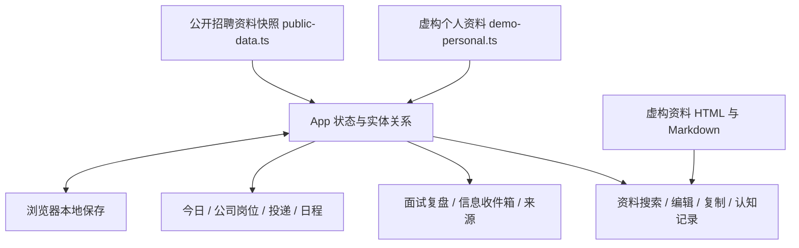

# 实现与数据说明

## 技术结构

React / TypeScript 管理页面与实体状态；Tailwind CSS 与项目样式保留原工作台布局，Motion 用于交互动画；Vite 构建静态文件。浏览器 localStorage 保存个人修改。当前产品没有必须依赖在线模型才能完成的核心操作。

## 发布时做了什么

- 保留原工作台所有页面组件、导航及主要交互，未沿用先前的精简展示版。
- 将原工程多个数据批次汇总为公开资料快照；替换个人偏好、实际投递、面试与资料底稿，不携带私人历史迁移代码。
- 保留公开公司与招聘来源；清除社群成员身份、私人渠道链接及个人内推信息。集团招聘页面只展示公开目录和待核验入口，不发布内部策略。
- 为每个浏览器使用独立的公开版存储键，不读取原工作台数据。
- 使用相对资源地址，适配 GitHub Pages 的项目子路径。
- 本地运势代理改为明确的展示小卡，保留原始网站链接。GitHub Pages 不运行原本的本地代理服务。

## 文件导航

| 路径 | 作用 |
| --- | --- |
| `src/App.tsx` | 页面切换、实体状态、弹窗与操作处理 |
| `src/components/` | 完整工作台的各个页面组件 |
| `src/types.ts` | 公司、岗位、日程、材料、复盘等字段定义 |
| `src/public-data.ts` | 公开招聘与知识资料快照 |
| `src/demo-personal.ts` | 连贯的虚构个人申请样例 |
| `public/application-materials.html` | 可搜索、编辑与复制的示例底稿 |
| `src/sample-interview-prep.md` | 认知记录示例 |
| `src/generated/ai-builders-news.ts` | AI资讯快照及来源 |
| `.github/workflows/pages.yml` | GitHub Pages 构建部署 |

## 能力范围

已具备的核心是信息组织、人工确认、资料取用、个人状态和日程管理。公开版没有招聘账号登录、自动投递、后台定时抓取、跨设备同步或运行时大模型调用。来源卡片用于解释与维护渠道，不等于平台已授权接入。日程提醒为页面内呈现，不是系统推送通知。

招聘资料保留历史核验信息，不是实时职位承诺。虚构个人日程相对首次打开时的日期生成；保存后沿用本机记录。

## 本轮验证

类型检查与生产构建通过。浏览器检查覆盖首页、个人投递阶段更新与刷新恢复、模拟面试详情、资料底稿加载等路径。完整验证结果见发布时的补充记录；这不构成所有浏览器与设备的兼容性承诺。

生产包包含较多招聘资料，当前仍会有构建体积提示。若后续持续扩展，可按模块加载数据并提供导入导出，但本次不借发布改动重构既有产品。
