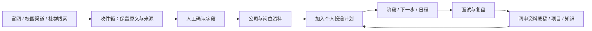

# 产品设计：让长期申请任务接得上

## 用户与使用时刻

当前核心用户是同时准备多个岗位的大学生。典型时刻包括：在群里看到一条机会但暂时没时间核对；晚上准备投递却找不到上次改好的项目描述；收到测评通知后需要与已有日程协调；面试结束后希望记录问题，下次能直接拿来准备。

目标不是让用户收藏更多信息，而是让信息能够进入下一步行动。对作者而言，长期使用的标准是：打开页面能找回进度，材料能直接取用，未知信息不会被遗漏，重要节点能放在一起看。

## 四个关键产品判断

### 1. 先保存线索，再确认机会

外部消息的格式和可信度不一致。收件箱保留原始内容与来源，再由使用者核对公司、岗位、城市、截止日期和入口。来源管理解释信息从哪里来；岗位页面承载整理后的信息。现有规则提取需要人工校验，不能替代官网核对。

### 2. 招聘事实与个人进度分开

公司是否开放招聘、岗位何时截止，是外部信息；我是否准备好材料、是否投递、下一步做什么，是个人状态。分开以后，岗位不需要为了展示一个人的进度而改变招聘事实，申请记录也可以独立保留。

### 3. 材料按“反复取用”组织

一份简历不足以覆盖所有网申字段。资料底稿保留完整教育、实习、项目、校园工作和自我介绍，再通过搜索、章节导航和复制支持取用。认知记录承载不断变化的理解和方法，避免把临时想法直接混入正式申请正文。

### 4. 复盘要产生下一步

保存“被问了什么”只是起点。复盘增加考察意图、关联经历、回答策略和下一轮动作，让面试记录能继续服务于准备。示例详细展示这一流程，没有用真实企业面经冒充虚构内容。

## 一条完整用户路径

## 从个人工具到更广泛的产品

求职与保研申请共享“机会—条件—材料—截止—阶段—结果”的基础关系，但所需字段不同。保研通常还需要院系、导师方向、推荐信及夏令营安排；这些目前只是扩展设想，不应直接用招聘岗位字段冒充完整适配。

可验证的产品化方向是提供不同申请任务的模板、材料版本管理和可靠的备份，再观察用户能否自行完成一次完整流程。第一轮研究可以邀请不同背景的学生完成“收集一条信息、确认、加入计划、找到材料、创建日程”这五步，记录卡住的位置、误解与重复操作。

商业机会仍是待验证的假设。基础整理、长期材料管理、跨设备保存与经用户确认的辅助处理，可能对应不同使用深度；需要先验证使用频率和持续价值，再讨论收费或机构协作。当前未做付费验证、市场规模测算或商业化收入。

## 迭代依据

项目由作者在个人秋招中持续使用。已有设计稿与代码体现了从招聘信息归纳，逐步加入公司研究、个人阶段、网申底稿、面试复盘与学习内容的过程。这次公开发布保持现有完整界面，主要工作是私人数据替换、资源路径适配与项目说明。
